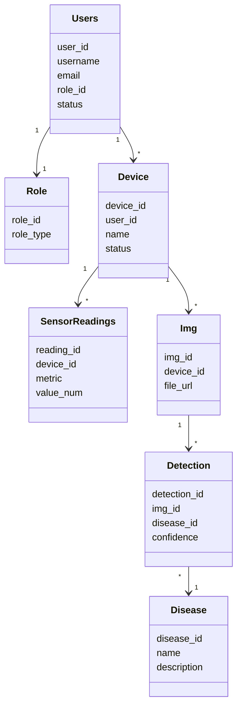
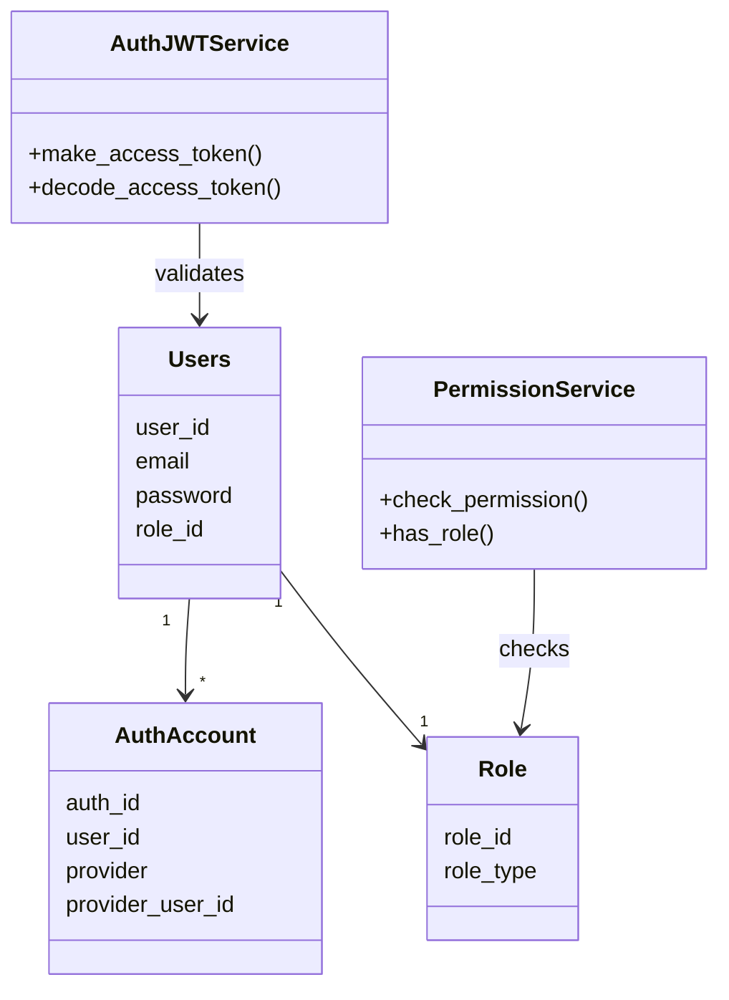
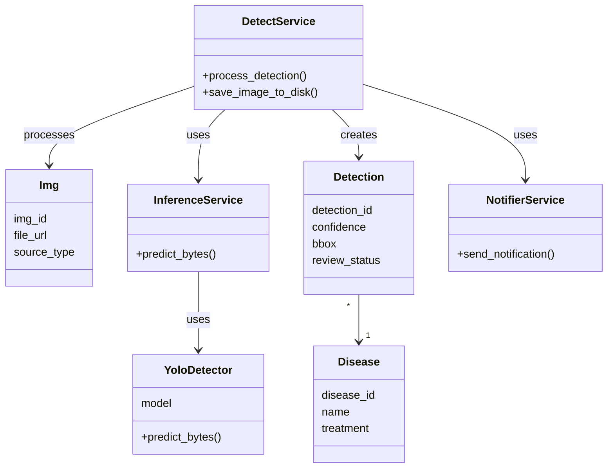

# Mermaid Class Diagram - Hệ Thống Phát Hiện Bệnh Cây

## Link xem trực tiếp:
https://mermaid.live/

## Cách sử dụng:
1. Copy code dưới đây
2. Vào https://mermaid.live
3. Paste vào editor bên trái
4. Xem diagram bên phải

---

## Diagram Mermaid - Complete Class Diagram

```mermaid
classDiagram
    %% ==================== USERS & AUTHENTICATION ====================
    class Users {
        +BigInt user_id
        +BigInt role_id FK
        +String username
        +String email
        +String phone
        +String avt_url
        +String address
        +Enum status
        +String password
        +Int failed_login
        +DateTime locked
        +DateTime created_at
        +DateTime updated_at
    }

    class Role {
        +BigInt role_id
        +Enum role_type
        +String description
    }

    class AuthAccount {
        +BigInt auth_id
        +BigInt user_id FK
        +Enum provider
        +String provider_user_id
        +Bool phone_verified
        +DateTime created_at
    }

    class UserSettings {
        +BigInt user_setting_id
        +BigInt user_id FK
        +String color
        +String font_size
        +String language
        +Bool notification_enabled
        +Bool auto_connect
        +Bool share_data_with_ai
    }

    %% ==================== DEVICES & IoT ====================
    class Device {
        +BigInt device_id
        +BigInt user_id FK
        +String name
        +BigInt device_type_id FK
        +BigInt parent_device_id FK
        +String serial_no
        +String location
        +Enum status
        +String stream_url
        +DateTime created_at
        +DateTime updated_at
    }

    class DeviceType {
        +BigInt device_type_id
        +String device_type_name
        +Bool has_stream
        +Enum status
        +DateTime created_at
    }

    class SensorReadings {
        +BigInt reading_id
        +BigInt device_id FK
        +String metric
        +Decimal value_num
        +String unit
        +Enum status
        +DateTime recorded_at
    }

    class DeviceLogs {
        +BigInt log_id
        +BigInt device_id FK
        +Enum event_type
        +String description
        +DateTime created_at
    }

    %% ==================== IMAGE & DETECTION ====================
    class Img {
        +BigInt img_id
        +String source_type
        +BigInt device_id FK
        +BigInt user_id FK
        +String file_url
        +DateTime created_at
    }

    class Detection {
        +BigInt detection_id
        +BigInt img_id FK
        +BigInt disease_id FK
        +Decimal confidence
        +String description
        +String treatment_guideline
        +JSON bbox
        +Enum review_status
        +String model_version
        +DateTime created_at
    }

    class Disease {
        +BigInt disease_id
        +String name
        +String description
        +String treatment_guideline
        +DateTime created_at
    }

    %% ==================== NOTIFICATION & SUPPORT ====================
    class Notifications {
        +BigInt notification_id
        +BigInt user_id FK
        +BigInt sender_id FK
        +String title
        +String description
        +DateTime created_at
        +DateTime read_at
        +BigInt resend_of FK
    }

    class SupportTicket {
        +BigInt ticket_id
        +BigInt user_id FK
        +String title
        +String description
        +Enum status
        +DateTime created_at
    }

    class SupportMessage {
        +BigInt message_id
        +BigInt ticket_id FK
        +BigInt sender_id FK
        +String message
        +String attachment_url
        +DateTime created_at
    }

    %% ==================== CHATBOT ====================
    class Chatbot {
        +BigInt chatbot_id
        +BigInt user_id FK
        +DateTime created_at
        +DateTime end_at
        +Enum status
    }

    class ChatbotDetail {
        +BigInt detail_id
        +BigInt chatbot_id FK
        +String question
        +String answer
        +DateTime created_at
    }

    %% ==================== SERVICES (Abstract) ====================
    class DetectService {
        +save_image_to_disk()
        +ensure_disease()
        +process_detection()
        +_normalize_bbox()
    }

    class InferenceService {
        +predict_bytes()
        +get_disease_for_result()
        +_no_detection_explanation()
    }

    class YoloDetector {
        +model
        +names
        +predict_bytes()
    }

    class DeviceService {
        +list_devices()
        +get_device()
        +list_devices_of_user()
        +create_device()
        +update_device()
        +delete_device()
    }

    class AuthJWTService {
        +make_access_token()
        +decode_access_token()
        +make_refresh_token()
        +decode_refresh_token()
    }

    class NotifierService {
        +send_notification()
        +broadcast_notification()
        +send_email()
        +send_sms()
    }

    class DashboardService {
        +get_dashboard()
        +get_stats()
        +get_latest_detections()
    }

    class ChatbotService {
        +start_session()
        +add_question_answer()
        +end_session()
    }

    class PermissionService {
        +check_permission()
        +has_role()
        +require_permission()
    }

    %% ==================== RELATIONSHIPS ====================
    
    %% Users relationships
    Users "1" --> "1" Role : has
    Users "1" --> "1" UserSettings : has
    Users "1" --> "*" Device : owns
    Users "1" --> "*" AuthAccount : has
    Users "1" --> "*" Img : uploads
    Users "1" --> "*" Notifications : receives
    Users "1" --> "*" SupportTicket : creates
    Users "1" --> "*" Chatbot : uses
    Users "1" --> "*" SupportMessage : sends

    %% Device relationships
    Device "1" --> "1" DeviceType : has_type
    Device "1" --> "*" SensorReadings : records
    Device "1" --> "*" DeviceLogs : generates
    Device "1" --> "*" Img : captures
    Device "*" --> "0..1" Device : parent

    %% Image & Detection relationships
    Img "1" --> "*" Detection : has
    Detection "*" --> "1" Disease : diagnoses
    Detection "*" --> "1" Img : on

    %% Support relationships
    SupportTicket "1" --> "*" SupportMessage : contains
    Notifications "0..1" --> "0..1" Notifications : resends

    %% Chatbot relationships
    Chatbot "1" --> "*" ChatbotDetail : contains

    %% Service dependencies
    DetectService --> InferenceService : uses
    DetectService --> Img : creates
    DetectService --> Detection : creates
    InferenceService --> YoloDetector : uses
    DetectService --> NotifierService : uses
    DeviceService --> Device : manages
    DeviceService --> DeviceType : uses
    AuthJWTService --> Users : validates
    NotifierService --> Notifications : creates
    ChatbotService --> Chatbot : manages
    PermissionService --> Role : checks
```

---

## Diagram Mermaid - Simplified User & Device Flow

---

## Diagram Mermaid - Authentication Flow

---

## Diagram Mermaid - Detection Pipeline

---

## Cách copy và sử dụng:

### Option 1: Dùng Mermaid Live Editor
1. Vào: https://mermaid.live
2. Copy một trong các diagram trên
3. Paste vào phần editor bên trái
4. Xem kết quả bên phải

### Option 2: Dùng VS Code Extension
1. Install extension: "Markdown Preview Mermaid Support"
2. Tạo file `.md` có chứa code mermaid
3. Xem preview bên cạnh

### Option 3: Dùng GitHub
- Commit file này lên GitHub
- GitHub sẽ tự render diagram Mermaid

---

## Các diagram có sẵn:
1. ✅ Complete Class Diagram (chi tiết nhất)
2. ✅ Simplified User & Device Flow (đơn giản)
3. ✅ Authentication Flow (xác thực)
4. ✅ Detection Pipeline (quy trình detection)

